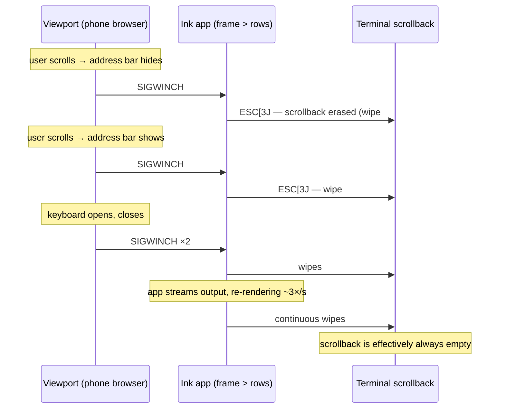

# When output exceeds terminal height, every re-render erases the user's entire scrollback (`ESC[3J`) — and the only alternative is duplicate-stamping

## Summary

> **Terminology:** the *frame* is the block of lines Ink renders and live-updates — the app's current UI (in Claude Code: the streaming response + input box + status bar). On every state change Ink erases and redraws it in place. Content that has scrolled off above it is ordinary committed terminal history.

When an Ink app's frame is taller than the terminal viewport, **every single re-render wipes the terminal's entire scrollback buffer** — including the user's own shell history from before the app started. Measured on `ink@7.1.1`:

| Verified behavior (ink@7.1.1, tmux, macOS, node 23) | Result |
|---|---|
| Ticking 40-row app in a 20-row terminal, 4 seconds | **12 full-scrollback wipes** (`ESC[2J ESC[3J ESC[H` per render) |
| 102 lines of shell history in scrollback, then one window resize while the app runs | **0 lines remain** — everything before the app is gone |
| Phone/web terminals (address bar fires a resize on nearly every scroll gesture; the on-screen keyboard fires two per message) | scrollback is effectively **permanently empty** while a tall Ink app runs |

**The whole failure in one loop** — Ink's actual captured byte output replayed through xterm.js:

*(GIF: `ink-scrollback-wipe.gif` — app running → scroll up, history intact → one resize → history gone)*

**Before** — 80×24, user scrolled up; 100 lines of shell history intact above the running app:

*(screenshot: `ink-before-resize.png`)*

**After one resize (80→64 cols)** — Ink emitted `ESC[3J`; scrolling up shows nothing:

*(screenshot: `ink-after-resize.png`)*

## Mechanism

Ink erases previous frames with cursor-relative motion ([`src/log-update.ts`](https://github.com/vadimdemedes/ink/blob/master/src/log-update.ts)):

```ts
// standard renderer
stream.write(returnPrefix + ansiEscapes.eraseLines(previousLineCount) + str + cursorSuffix);
// incremental renderer
buffer.push(ansiEscapes.cursorUp(previousLines.length - 1));
```

Cursor motion is **viewport-relative**: once part of the frame has scrolled off the top, `cursorUp` saturates at the viewport edge and the scrolled-off rows are unreachable. Ink handles this in [`src/ink.tsx`](https://github.com/vadimdemedes/ink/blob/master/src/ink.tsx) by clearing the terminal whenever the frame overflows:

```ts
const isFullscreen = isTty && outputHeight >= viewportRows;
const shouldClearTerminal = shouldClearTerminalForFrame({ ... });
// when true:
this.options.stdout.write(ansiEscapes.clearTerminal + ...)
```

`ansiEscapes.clearTerminal` is `ESC[2J ESC[3J ESC[H` — and **`ESC[3J` erases the scrollback buffer**, not just the screen. Byte capture of a re-rendering overflowing app confirms one `3J` per render (12 in 4s). Resize goes through the same path ([`resized()`](https://github.com/vadimdemedes/ink/blob/master/src/ink.tsx) → `calculateLayout()` → `onRender()`), plus `log.clear()` on width shrink — so **every SIGWINCH wipes scrollback too**.

```
    THE OVERFLOW DILEMMA — cursor motion can't reach scrolled-off rows,
    so a frame taller than the viewport forces one of two failure modes:

  ┌╌╌ scrollback ╌╌╌╌╌╌┐            ┌╌╌ scrollback ╌╌╌╌╌╌┐
  │ (user's shell       │           │ frame rows 1-10     │ ◄ stale copy 1
  │  history: ERASED    │           │ frame rows 1-10     │ ◄ stale copy 2
  │  by ESC[3J on every │           │ frame rows 1-10     │ ◄ stale copy 3 …one per re-render
  │  re-render)         │           ├──── viewport ───────┤
  ├──── viewport ───────┤           │ frame rows 11-30    │
  │ frame rows 11-30    │           │                     │
  └─────────────────────┘           └─────────────────────┘
   MODE A: ink@7.1.1 today           MODE B: fork without ESC[3J
   "destroy the scrollback"          "duplicate-stamp the scrollback"
```



## Mode B at scale: the duplicate-stamping variant (Claude Code case study)

Dropping the `ESC[3J]` (as downstream forks do — Claude Code's bundled renderer repaints with `ESC[H` + a full pre-wrapped rewrite and no scrollback clear, verified by PTY capture) preserves scrollback but trades destruction for **duplication**: every repaint's overflow scrolls another copy of the frame top into scrollback, and nothing can ever erase it.

*(GIF: `ink-claude-dup.gif` — real Claude Code session: response appears once → three window resizes → the same response stamped 5×, duplicates highlighted)*

Reproduced in tmux with byte capture: a two-paragraph response went from 2 occurrences (prompt echo + response) to **5** after three resizes — one stamp per resize — while shell history stayed intact; the captured resize bytes contain **zero** `ESC[3J`/`ESC[2J`, only `ESC[H` + full rewrites.

Measured in real Claude Code sessions on a phone-sized web terminal:

- 4 window-width changes over a short conversation → every transcript paragraph appeared **3–4×** in scrollback;
- a few minutes of scrolling on a phone (one resize per gesture) with an overflowing frame → the welcome screen stamped **~70×** ≈ **2,100 junk lines**;
- because each stamp is wrapped to the width at that moment, copies are not byte-identical, so terminals can't trivially deduplicate them — and interrupted repaints were observed committing spliced partial rows (`ClauClaudeeCode`, `…planet's landg`).

So both available strategies lose: **wipe the user's history, or bury it in stale copies.**

## Reproduction (verified end-to-end before filing)

```js
// repro.js  (plain node, no JSX/build step — package.json needs "type": "module")
import React from 'react';
import {render, Text, Box} from 'ink';

const h = React.createElement;
const rows = Array.from({length: 40}, (_, i) =>
	h(Text, {key: i}, `row-${String(i + 1).padStart(2, '0')} the quick brown fox jumps over the lazy dog`)
);
render(h(Box, {flexDirection: 'column'}, ...rows));
setInterval(() => {}, 1 << 30); // keep the process alive so resizes reach a live app
```

```bash
npm init -y && npm pkg set type=module && npm i ink react

tmux new-session -d -s inkdemo -x 80 -y 24
tmux send-keys -t inkdemo 'seq -f "shell-history-line-%.0f" 1 100' Enter && sleep 1
tmux capture-pane -t inkdemo -p -S -3000 | grep -c shell-history-line   # → 102 (history present)

tmux send-keys -t inkdemo 'node repro.js' Enter && sleep 2
tmux resize-window -t inkdemo -x 64 -y 24 && sleep 1
tmux capture-pane -t inkdemo -p -S -3000 | grep -c shell-history-line   # → 0 (history erased)
```

Byte-level confirmation (via `tmux pipe-pane`): the resize emits exactly one `ESC[2J ESC[3J ESC[H` followed by the full frame; a state-updating variant of the same app emits one per render (12 wipes in 4 s at ~3 renders/s).

## Can this be mitigated downstream? (we tried — here's how far it goes)

We hit Mode B at scale through [reminal](https://github.com/harshalgajjar/Reminal), a terminal-sharing tool we maintain — it puts any terminal session (Claude Code included) in a phone browser, which is exactly the small-viewport, resize-happy environment where this bug bites hardest. Everything below is implemented and battle-tested there; the cleanup lives in [`internal/client/dedup.go`](https://github.com/harshalgajjar/Reminal/blob/main/internal/client/dedup.go) and [`internal/client/agent.go`](https://github.com/harshalgajjar/Reminal/blob/main/internal/client/agent.go) for anyone who wants to study or borrow it. A terminal cannot change the app, so the only options are heuristics on the emitted bytes. Sharing what proved necessary mainly as a data point for how much machinery the workaround takes — any terminal or multiplexer author attempting the same will need equivalents of all three:

1. **Resize-jitter coalescing** — debounce viewport-size reports (shrinks fast; small rows-only grows only after 2 s of stability) so the app sees ~1 SIGWINCH per real transition instead of one per scroll gesture. This alone reduced stamping ~30×.
2. **Captured-frame resize segments** — at each SIGWINCH, snapshot the words of the screen being repainted and where its overflow will land in scrollback. A row is later dropped only if it word-matches the frame captured at *that* resize **and** the same content provably occurs again later. Stale copies always re-occur; genuine output never matches — lossless by construction.
3. **Paragraph-level and truncated-prefix dedup** for the residue, plus periodic re-sync of live viewers.

This gets real sessions to roughly every content line exactly once — but it required a server-side VT emulator, word-level fuzzy matching, and careful correctness arguments to approximate what the app could guarantee in one line of intent: *don't touch what has scrolled away.*

One more finding from running this in production, relevant to anyone considering downstream cleanup: **the mitigation's memory must be unbounded in principle.** A stamped copy stays in scrollback for as long as the scrollback lives, so the cleaner must remember *every* resize's fingerprint for that entire lifetime. We initially kept the last 32 resize fingerprints; real phone sessions (a keyboard show/hide per message, reconnects whenever the phone sleeps) exhausted that within minutes, and any stamp older than the window became permanently uncleanable — the copies had drifted into differently-wrapped, splice-corrupted variants no content matcher can safely pair. We now keep 1024 and it is still only a budget, not a bound. The app, by contrast, needs no memory at all — it just has to not re-emit what already scrolled off.

## Suggested directions

1. **Clamp the frame to the viewport.** When `outputHeight > rows`, render only the bottom `rows` lines and never rewind/erase/rewrite above them. Content that has scrolled off is, by definition, already committed history.
2. **Flush overflow through the `<Static>` pipeline exactly once** — the mechanism for append-only content already exists.
3. **At minimum, use `ESC[2J` + home instead of `clearTerminal`'s `ESC[3J`** so the clear path stops destroying the user's scrollback (also raised in #621). This converts Mode A into Mode B, which is less destructive but still leaks copies — 1–2 are the real fix.

Happy to provide the raw byte captures, the xterm.js replay page used for the screenshots, or to test a branch.

Related: #621 (scrollback cleared when UI taller than terminal), #907 (resize artifacts when wrapping changes row count), #450, #359 (flicker when taller than screen), #222, #153; downstream: anthropics/claude-code#51828.

---
*Environment: ink@7.1.1, node v23.10.0, tmux 3.x, macOS 14; behavior confirmed by raw PTY byte capture (`tmux pipe-pane`) and replay through xterm.js 5.5.*
